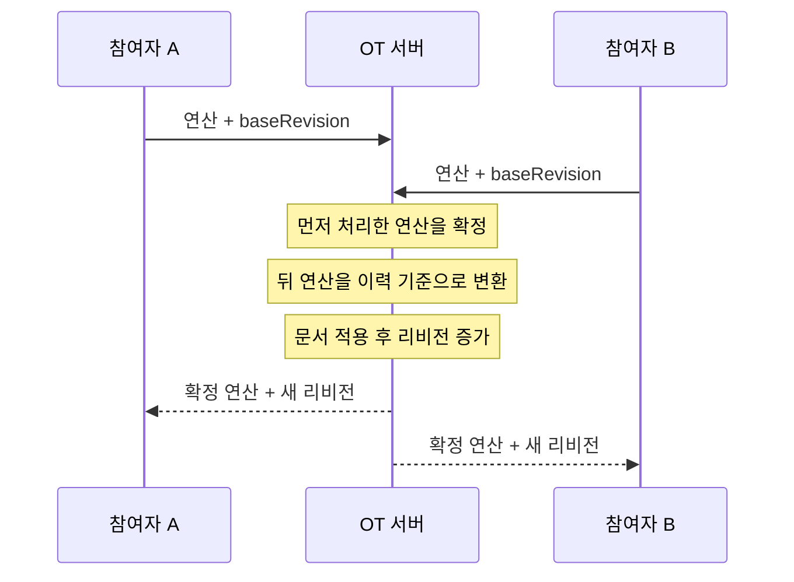
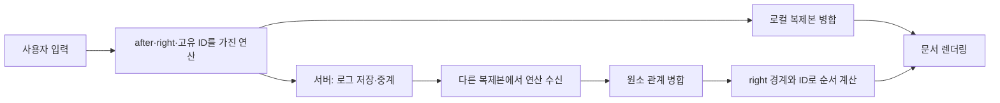

# 동시에 쓰는 문서는 어떻게 하나가 될까?

## Operational Transformation과 CRDT

---

# 이 주제를 선택한 이유

온라인 문서, 메모, 코드 편집기는 여러 사람이 서로 다른 네트워크에서 같은 내용을 동시에 수정합니다.

이때 각 사용자는 자기 입력을 즉시 봐야 하고, 잠시 뒤에는 모두 같은 문서를 봐야 합니다.

```text
동시 편집 → 서로 다른 입력 순서 → 하나의 최종 문서
```

이 발표에서는 이 문제를 해결하는 두 접근인 OT와 CRDT를 비교합니다.

---

# 어떤 방식이 있는가?

두 방식의 공통 목표는 **수렴(Convergence)** 입니다.

```text
여러 참여자의 복제본 ── 동시 편집 ── 같은 최종 문서
```

| 방식 | 충돌 처리의 중심 | 핵심 질문 |
| --- | --- | --- |
| OT | 서버의 연산 변환 | 바뀐 문서에서 이 위치 연산은 어디로 가야 하는가? |
| CRDT | 각 복제본의 병합 규칙 | 이 원소들을 어떤 순서로 표시해야 하는가? |

---

# OT는 위치 기반 연산을 변환한다

OT에서 편집은 문서의 숫자 위치를 기준으로 표현합니다.

```text
insert(position, text)
delete(position, length)
```

서버는 확정 문서, 리비전, 이전 연산 이력을 관리합니다. 늦게 도착한 연산은 이미 적용된 연산 때문에 위치가 달라졌을 수 있으므로, 서버가 위치나 삭제 길이를 변환한 뒤 적용합니다.

---

# OT의 처리 순서

1. 클라이언트가 현재 서버 리비전을 `baseRevision`으로 기록합니다.
2. 사용자의 입력을 삽입·삭제 위치 연산으로 만듭니다.
3. 서버는 `baseRevision` 이후 확정된 이력을 확인합니다.
4. 서버는 새 연산을 그 이력 기준으로 변환합니다.
5. 서버는 변환된 연산을 문서에 적용하고 리비전을 증가시킵니다.
6. 서버는 확정 연산과 새 리비전을 모든 참여자에게 보냅니다.

---

# OT의 처리 흐름



OT에서 최종 순서와 위치는 서버가 확정합니다.

---

# OT 데모 사이트에서 함께 확인할 것

- 같은 방 링크로 접속하면 하나의 서버 문서 상태를 공유합니다.
- 각 입력은 대기 연산으로 표시되고, 서버가 확정하면 리비전이 증가합니다.
- 연산 로그에는 확정 시각, 수정자 색, 삽입·삭제 연산이 표시됩니다.
- 동시에 입력했을 때 서버가 연산을 변환·순서화하는 과정을 확인합니다.

---

# CRDT는 경계를 가진 원소를 병합한다

CRDT에서 문자는 단순한 숫자 위치의 값이 아니라, 고유 ID를 가진 원소입니다.

```text
element = {
  id: "clientId:counter",
  after: "왼쪽 경계 원소 ID",
  right: "오른쪽 경계 원소 ID 또는 끝",
  value: "문자",
  deleted: false
}
```

`right`는 현재 다음 문자를 가리키는 포인터가 아니라, 원소를 만들 때 관측한 오른쪽 경계입니다.

---

# CRDT의 처리 순서

1. 클라이언트는 커서 위치를 `after`와 `right` 원소 ID로 바꿉니다.
2. 삽입은 고유 ID와 양쪽 경계를 가진 새 원소를 만듭니다.
3. 삭제는 숫자 범위 대신 삭제할 원소 ID 목록을 만듭니다.
4. 클라이언트는 자신의 연산을 먼저 로컬 복제본에 병합합니다.
5. 서버는 연산을 기록하고 다른 클라이언트로 중계합니다.
6. 각 클라이언트는 받은 원소를 병합하고 같은 순서 규칙으로 문서를 다시 만듭니다.

---

# CRDT의 원소 순서와 삭제

새 원소는 `right` 경계가 가리키는 원소보다 앞에 배치됩니다.

같은 `after`와 `right` 경계 사이에 동시에 삽입된 원소끼리만 고유 ID로 순서를 결정합니다. 서버 도착 순서는 이 규칙의 기준이 아닙니다.

삭제된 원소는 자료 구조에서 지우지 않고 `deleted: true`로 표시합니다. 화면에서는 숨기지만, 다른 원소가 참조할 수 있는 구조적 기준점은 유지합니다.

---

# CRDT의 처리 흐름



현재 데모는 서버가 중계하는 RGA 계열의 간단한 CRDT 구현입니다. 서버는 OT처럼 위치를 변환하지 않습니다.

---

# CRDT 데모 사이트에서 함께 확인할 것

- 같은 방 링크로 접속하면 각 브라우저가 같은 연산 로그를 받아 복제본을 만듭니다.
- 입력 직후 로컬 병합되며, 커서는 입력한 문자 뒤에 유지됩니다.
- 고유 원소 수와 삭제 표식 수로 자료 구조의 변화를 확인합니다.
- 동시에 같은 구간에 삽입했을 때, 모든 참여자가 같은 원소 순서를 계산하는지 확인합니다.

---

# OT와 CRDT 비교

| 관찰 항목 | OT | CRDT |
| --- | --- | --- |
| 편집의 표현 | 위치 기반 삽입·삭제 | 고유 원소 ID + `after`·`right` 경계 |
| 충돌 처리 중심 | 서버의 변환과 리비전 | 각 복제본의 병합과 순서 규칙 |
| 서버 역할 | 문서·이력 관리, 변환, 확정 | 연산 로그 저장·중계 |
| 동시 삽입 순서 | 서버 변환 정책 | 같은 경계의 원소 ID 규칙 |
| 삭제 | 문서 문자열에서 제거 | tombstone으로 관계 유지 후 화면에서 숨김 |
| 공통 결과 | 모든 참여자의 문서 수렴 | 모든 참여자의 문서 수렴 |

---

# 마무리

```text
OT   = 서버가 위치 기반 연산을 변환하고 확정한다.
CRDT = 각 복제본이 경계를 가진 원소를 병합해 수렴한다.
```

두 방식은 같은 공동 편집 문제를 다른 방식으로 해결합니다.
