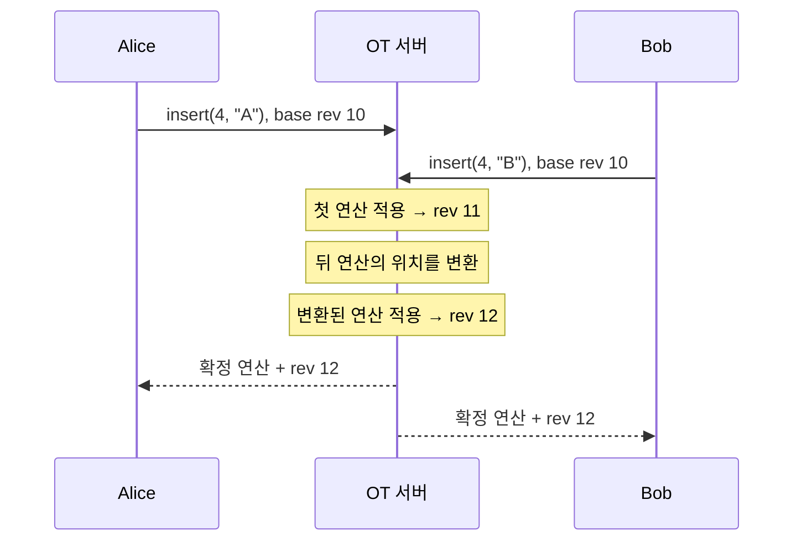
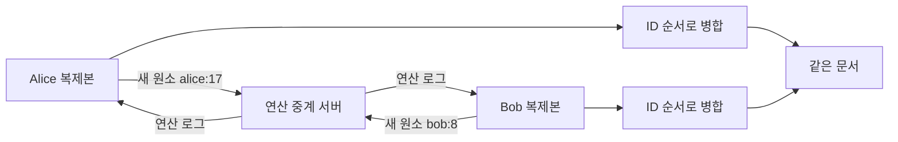

# 동시에 쓰는 문서는 어떻게 하나가 될까?

## Operational Transformation (OT) vs CRDT

여러 사람이 서로 다른 네트워크에서 같은 문서를 동시에 편집할 때,
각자의 화면은 어떻게 결국 같은 문서가 될까요?

---

# 오늘의 실험

- 참여자는 링크로 같은 방(room)에 접속합니다.
- 각자 색을 고르고 동시에 문서를 수정합니다.
- 글자 배경색, 초 단위 로그, 디지털 시계로 편집 흐름을 관찰합니다.
- OT와 CRDT가 **같은 목표(수렴)** 를 다른 방식으로 달성하는 모습을 비교합니다.

> 핵심 질문: 충돌한 편집을 누구나 같은 결과로 보게 하려면 무엇이 필요할까?

---

# 공통 목표: 수렴(Convergence)

Alice와 Bob이 거의 동시에 문서를 고쳐도,
잠시 뒤에는 모든 참여자가 같은 내용을 봐야 합니다.

```text
Alice의 문서 ─┐
              ├─ 같은 최종 문서
Bob의 문서   ─┘
```

OT와 CRDT 모두 이 목표를 만족합니다.
차이는 “충돌을 표현하고 해결하는 위치”에 있습니다.

---

# OT: 위치 기반 편집 연산을 변환한다

OT에서 편집은 문서의 특정 위치를 기준으로 한 연산입니다.

```text
insert(position=4, text="A")
delete(position=7, length=2)
```

서버는 문서의 현재 리비전과 이전 연산 이력을 가집니다.
늦게 도착한 연산은 이미 적용된 연산 때문에 위치가 달라졌을 수 있으므로,
서버가 위치를 다시 계산한 뒤 적용합니다. 이것이 **변환(Transformation)** 입니다.

---

# OT: 글로 보는 동작 과정

1. Alice는 리비전 10의 문서에서 4번 위치에 `A`를 삽입합니다.
2. Bob도 리비전 10의 문서에서 같은 위치에 `B`를 삽입합니다.
3. 서버는 먼저 처리된 연산을 문서에 적용해 리비전 11을 만듭니다.
4. 나중 연산의 위치를 앞선 연산 기준으로 변환합니다.
5. 변환된 연산을 적용해 리비전 12를 만들고, 결과를 모두에게 전달합니다.

즉, OT는 **서버가 연산의 순서와 위치를 조정**해서 문서를 하나로 만듭니다.

---

# OT: Mermaid로 보는 동작 과정



---

# OT 데모에서 볼 것

- **서버 리비전**: 서버가 확정한 문서 버전입니다.
- **대기 연산**: 아직 서버 확인을 기다리는 내 편집입니다.
- **연산 흐름**: 시각 · 수정자 색 · 삽입/삭제 위치가 보입니다.
- **서버 권위**: 서버가 모든 연산을 순서화해 최종 상태를 정합니다.

# OT 데모의 현재 충돌 정책

현재 구현은 서버가 먼저 받은 연산을 확정하고, 나중 연산을 이력에 맞춰 변환합니다.

- 같은 위치의 삽입은 연산 ID로 순서를 정합니다.
- 겹치는 삭제와 삽입은 서버 도착 순서가 결과에 영향을 줄 수 있습니다.
- 따라서 이 부분은 “삭제 우선” 또는 “삽입 우선”을 고정한 정책이 아니라, 서버 직렬화 순서에 영향을 받는 정책입니다.

# CRDT: 고유한 원소를 병합한다

CRDT에서 글자는 단순히 “3번 위치의 문자”가 아닙니다.
각 글자는 고유 ID와 앞 원소를 가리키는 관계를 가집니다.

```text
element = {
  id: "alice:17",
  after: "bob:4",
  value: "A"
}
```

삭제도 위치를 지우는 대신, 기존 원소를 삭제됨(tombstone)으로 표시합니다.

---

# CRDT: 글로 보는 동작 과정

1. Alice는 `alice:17`이라는 새 문자 원소를 만듭니다.
2. Bob도 별도의 ID를 가진 문자 원소를 만듭니다.
3. 서버는 원소 연산을 중계하고 기록합니다.
4. 각 브라우저는 받은 원소를 자기 복제본에 병합합니다.
5. 같은 위치에 들어온 원소는 고유 ID의 결정론적 순서로 배치됩니다.
6. 삭제된 글자는 화면에서는 사라지지만, 원소의 삭제 표식은 남습니다.

즉, CRDT는 **원소의 정체성과 병합 규칙**으로 문서를 하나로 만듭니다.

---

# CRDT: Mermaid로 보는 동작 과정



---

# CRDT 데모에서 볼 것

- **고유 원소**: 문서에 만들어진 문자 원소의 수입니다.
- **삭제 표식**: 화면에서 사라졌지만 삭제됨으로 기록된 원소 수입니다.
- **병합 흐름**: 시각 · 수정자 색 · 삽입/삭제 원소가 보입니다.
- **로컬 병합**: 각 브라우저가 같은 원소 집합을 정렬해 문서를 구성합니다.

# CRDT 데모의 서버 역할

현재 구현은 완전한 P2P CRDT가 아니라 **서버 중계형 CRDT**입니다.

- 서버는 연산 로그를 저장하고 중계합니다.
- 브라우저는 원소 ID, `after` 관계, 삭제 표식을 저장합니다.
- 브라우저는 같은 부모 원소의 ID를 정렬해 문서 순서를 계산합니다.

# 같은 공동 편집, 다른 관찰 포인트

| 관찰 항목        | OT                         | CRDT                      |
| ---------------- | -------------------------- | ------------------------- |
| 편집의 표현      | 위치 + 삽입/삭제           | 고유 ID 원소 + 관계       |
| 충돌 처리 중심   | 서버의 변환과 리비전       | 각 복제본의 병합 규칙     |
| 삭제 뒤          | 문서 상태와 연산 이력 갱신 | 원소는 삭제 표식으로 유지 |
| 화면의 핵심 지표 | 서버 리비전                | 고유 원소, 삭제 표식      |
| 공통 결과        | 모든 참여자의 문서 수렴    | 모든 참여자의 문서 수렴   |

---

# 중요한 오해 바로잡기

OT와 CRDT의 목적은 “서로 다른 최종 문서”를 만드는 것이 아닙니다.

둘 다 충돌을 처리해 **같은 최종 문서로 수렴**해야 합니다.
발표에서 보여줄 차이는 결과 문장 자체보다 다음입니다.

- OT는 서버가 위치를 변환하고 리비전을 확정한다.
- CRDT는 각 문자의 ID와 삭제 표식을 병합한다.
- 같은 공동 편집 경험 뒤에 서로 다른 데이터 모델과 처리 과정이 있다.

---

# 마무리

```text
OT   = 중앙 서버가 연산을 변환해 순서화
CRDT = 각 복제본이 고유 원소를 병합해 수렴
```

두 방식 모두 실시간 공동 편집을 가능하게 합니다.
상황에 따라 서버 중심 제어, 오프라인 요구사항, 데이터 구조와 저장 비용을 고려해 선택합니다.

감사합니다.
