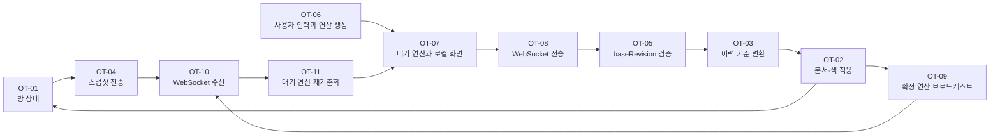

# OT 실시간 공동 편집 데모

서버가 문서, 리비전, 연산 이력을 관리하고 삽입·삭제 연산을 변환하는 Operational Transformation 데모입니다.

## 실행

```powershell
npm install
npm start
```

브라우저에서 `http://localhost:3000?room=발표방이름`을 열고 같은 주소를 여러 창에서 엽니다. 같은 방 이름은 같은 서버 문서 상태를 공유합니다.

## 온라인 발표 배포

이 폴더를 Render의 **Web Service**로 연결합니다.

| 설정          | 값            |
| ------------- | ------------- |
| Runtime       | Node          |
| Build Command | `npm install` |
| Start Command | `npm start`   |

`PORT`는 배포 플랫폼이 주입한 값을 자동 사용합니다. 서버 메모리는 실행 중에만 유지되므로, 발표 전에 새 방 이름을 사용하면 빈 문서에서 시작합니다.

## 라벨별 동작 방식

아래 순서는 코드 주석의 `[OT-01]`부터 `[OT-11]`까지와 같습니다. 이 절은 특정 문자열이나 숫자를 사용한 사례 없이 처리 구조만 설명합니다.

### OT-01 · 방 상태 생성

서버는 방마다 확정 문서 문자열, 문자별 색 배열, 현재 리비전, 확정 연산 이력, 연결된 소켓 집합을 보관합니다. 리비전은 서버가 연산 하나를 확정할 때마다 증가합니다.

### OT-02 · 문서와 색 적용

삽입 연산은 지정 위치에 문자열과 같은 수의 색 정보를 추가합니다. 삭제 연산은 지정 범위의 문자열과 색 정보를 함께 제거합니다. 서버 문서와 화면의 색상 레이어가 같은 길이를 유지하도록 처리합니다.

### OT-03 · 연산 변환

연산이 만들어진 문서 리비전과 서버의 현재 리비전이 다르면, 서버는 그 사이에 확정된 연산들과 새 연산을 차례로 변환합니다. 변환은 삽입·삭제 때문에 달라진 위치와 삭제 길이를 조정합니다. 같은 위치 삽입은 변경되지 않는 연산 ID로 순서를 정합니다.

### OT-04 · 초기 스냅샷

새 참여자가 방에 접속하면 서버는 현재 확정 문서, 색 정보, 리비전, 참여자 수를 전송합니다. 새 참여자는 과거 연산을 개별적으로 다시 적용하지 않고 이 스냅샷에서 시작합니다.

### OT-05 · 서버 확정

클라이언트는 자신의 연산과 그 연산이 만들어진 `baseRevision`을 보냅니다. 서버는 이력 변환, 위치 범위 제한, 문서 적용, 이력 저장, 리비전 증가를 마친 뒤 확정 연산을 모든 참여자에게 전송합니다.

### OT-06 · 클라이언트 입력 분해

클라이언트는 입력 전후 텍스트의 공통 앞부분과 뒷부분을 찾습니다. 달라진 중간 부분은 삭제 연산, 삽입 연산 또는 둘의 연속으로 분해됩니다.

### OT-07 · 대기 연산과 낙관적 화면

클라이언트는 생성한 연산을 서버 응답 전에 대기 목록과 로컬 문서에 적용합니다. 따라서 사용자는 확정 응답을 기다리지 않고 수정 내용을 봅니다. 대기열은 서버에 아직 확정되지 않은 연산만 유지합니다.

### OT-08 · WebSocket 전송

클라이언트는 대기열의 맨 앞 연산 하나를 `baseRevision`과 함께 서버로 전송합니다. 서버가 해당 연산을 확정해 돌려줄 때까지 다음 대기 연산은 전송하지 않습니다.

### OT-09 · 확정 연산 브로드캐스트

서버는 문서에 적용하고 리비전을 증가시킨 확정 연산을 같은 방의 모든 연결에 보냅니다. 모든 클라이언트는 서버가 보낸 이 순서를 기준으로 확정 상태를 갱신합니다.

### OT-10 · WebSocket 수신

클라이언트는 WebSocket으로 방에 입장하고 스냅샷, 확정 연산, 참여자 수 메시지를 수신합니다. 연결이 끊기면 재연결을 시도합니다. 화면의 시간과 로그 시간은 각각 현재 시각과 서버가 확정한 시각을 표시합니다.

### OT-11 · 원격 연산 재기준화

원격 연산을 받으면 클라이언트는 자신의 대기 연산을 원격 연산 기준으로 변환합니다. 이후 확정 리비전, 문서, 색상 레이어, 연산 로그를 갱신합니다. 자신의 연산이 서버에서 확정되면 대기 목록에서 제거합니다.

### 라벨 흐름도


